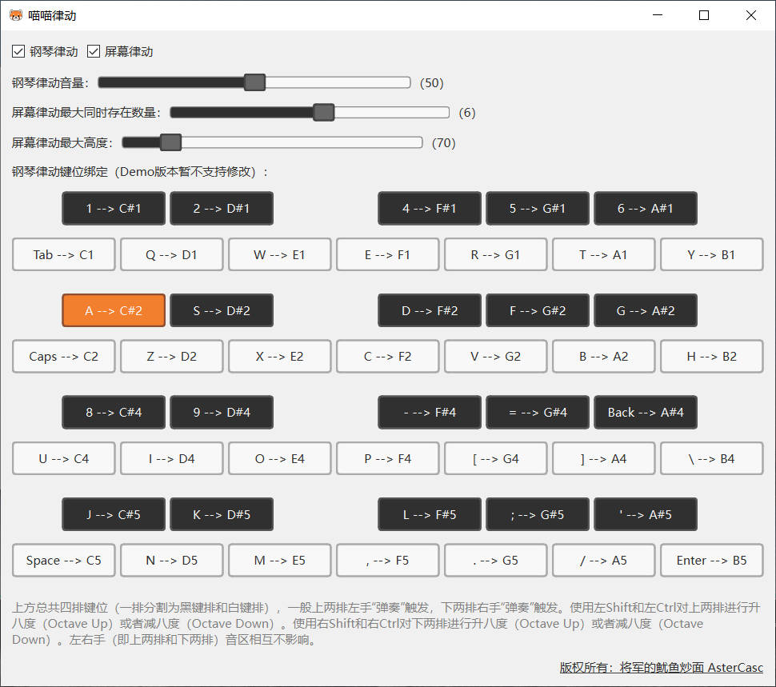
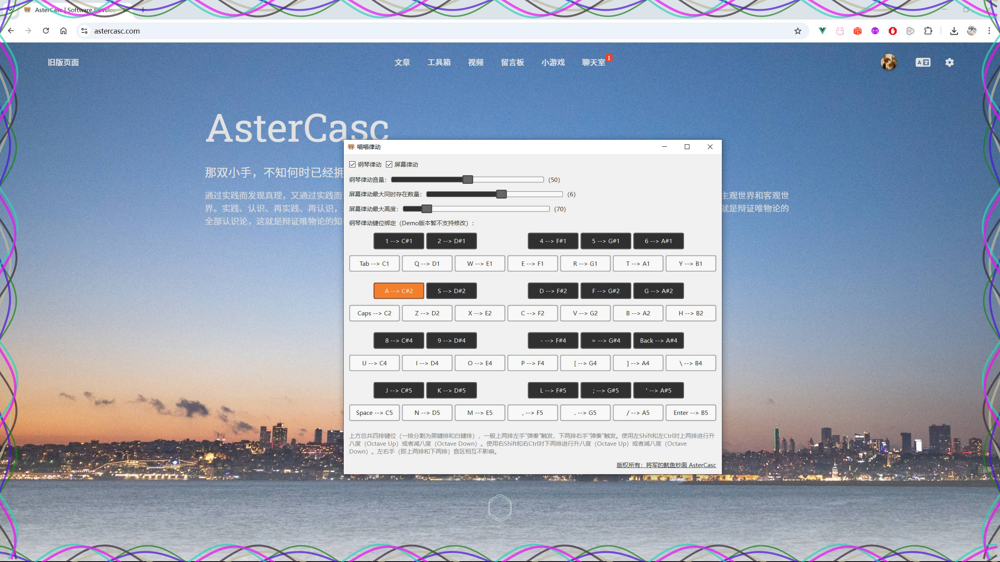

# Meow Piano

English | [中文](README_zh.md)

## Introduction


### Screenshots






## Documentation

For detailed documentation and extended information, please visit:
[Click here](https://www.astercasc.com/article/detail?articleId=AT202776160889761382)

If you have any questions, you can leave a comment at the bottom of that page.


## Download

Download links for the main program and required model files (choose one depending on your needs):

Baidu Netdisk: [Click here](https://pan.baidu.com/s/5P4zJnQ1tJkycI24FEcJC4Q)

GitHub Releases: [Click here](https://github.com/AsterCass/General-of-the-Red-Panda/releases)


## Development

If you are not modifying the project, you can skip this section.

* Install [uv](https://docs.astral.sh/uv/) and [Python](https://www.python.org/)

```shell
# Run
uv run app
# Build
uv run pyinstaller --onefile --noconsole --icon=assets/logo.ico --name 喵喵律动 --add-data "assets;assets"  src/meow_piano/__main__.py
# Refresh dependencies
uv lock --no-cache
uv sync
```


## Tech Stack
