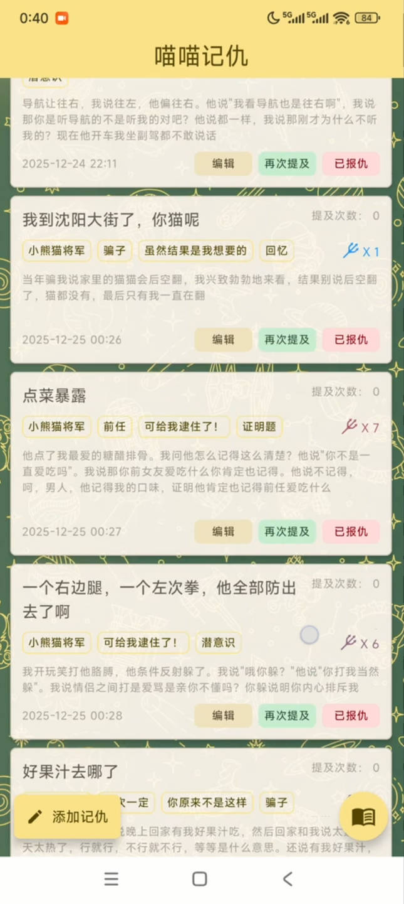
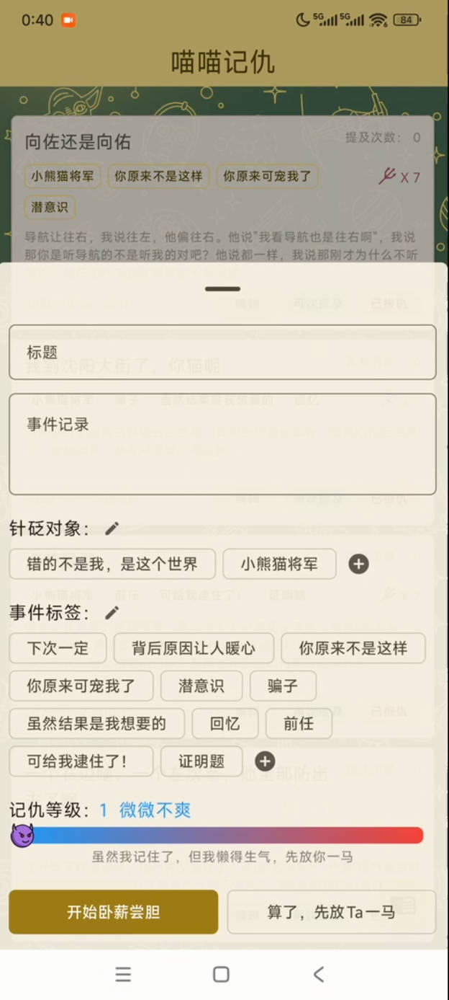
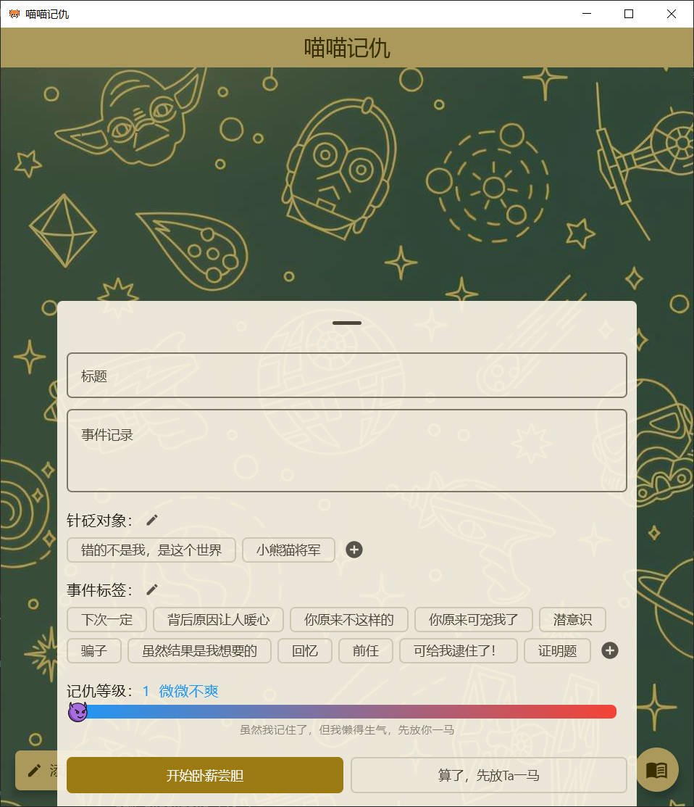
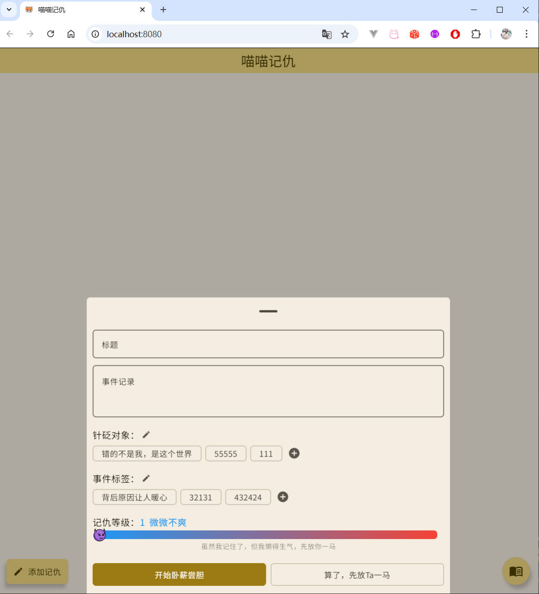

# 喵喵记仇

[English](README.md) | 中文

## 介绍

他不仅仅可以帮我们记录生活和工作当中的点点滴滴，让我们在该给客户服务的时候绝对不会弄错或者遗漏，而且还支持自定义标签和服务对象，让我们检索起来更加快速和高效。
我们特别添加了记仇等级的选项，让我们的记仇不再单调，轻松掌控服务力度。
更加人性化的是，我们检索的时候，可以选择升堂细数罪行，方便我们一手持手机，一只手服务，做到《是你的一个不漏，不是你的一个不凑》的核心原则。
当客户的反馈没有达到我们预期，我们可以使用《提及+1》来记录，来区分不同旧账的新鲜程度。
如果我们对客户的反馈非常满意，则可以使用《已报仇》来清除这个服务事项

## 相关资源下载地址

[点击此处](https://pan.baidu.com/s/5P4zJnQ1tJkycI24FEcJC4Q)

## 浏览器版本地址：

* https://www.astercasc.com/apps/grudgesWasmJs/ （注意，首次加载需要稍微等待一下加载核心包和字体）
* 备用地址（部分老式浏览器无法正常访问上面的地址的时候）：https://www.astercasc.com/apps/grudgesJs/

## 平台支持

| Android | IOS | Desktop/JVM | Web |
|:-------:|:---:|:-----------:|:---:|
|    √    |  √  |      √      |  √  |

## 截图

 

 

## 运行项目

### 安卓

在Android Studio打开直接运行即可

### 桌面

执行命令`./gradlew :composeApp:run`

打包 `./gradlew packageDistributionForCurrentOS`

### 网页

执行命令 `./gradlew :composeApp:jsBrowserDevelopmentRun` 或 `./gradlew :composeApp:wasmJsBrowserDevelopmentRun`

打包 `./gradlew jsBrowserDistribution` 或 `./gradlew wasmJsBrowserDistribution`

### 苹果

[示例](https://www.jetbrains.com/help/kotlin-multiplatform-dev/multiplatform-create-first-app.html#run-your-application-on-ios)

#### 提示

* 如果遇到
  `nw_proxy_resolver_create_parsed_array [C5.1 proxy pac] Evaluation error: NSURLErrorDomain: -1004`
  请关闭苹果手机代理或者模拟器所在电脑的代理

## 技术栈

- [Kotlin Multiplatform](https://kotlinlang.org/lp/multiplatform/)
- [Compose Multiplatform](https://www.jetbrains.com/lp/compose-multiplatform/)
- [Kotlin Coroutines](https://github.com/Kotlin/kotlinx.coroutines)
- [Koin](https://insert-koin.io/)
- [Voyager](https://github.com/adrielcafe/voyager)
- [Multiplatform Setting](https://github.com/russhwolf/multiplatform-settings)